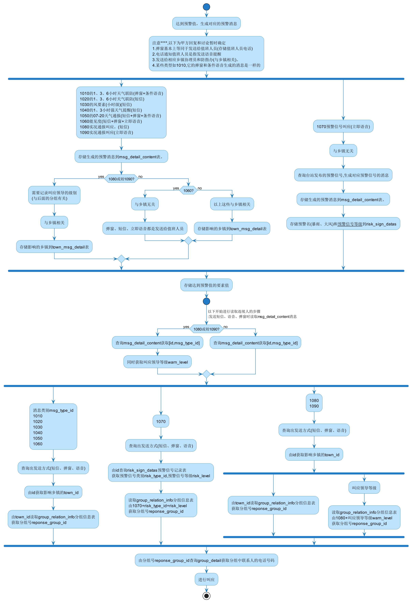

婺城预警短信生成暂定流程图
==========================

此流程图画于2023-1-6 by ks

**其中分组结构部分暂时未确定

暂时未确定的问题

1. 程序每分钟运行，当符合消息生成情况时便会生成消息。

    * 若此时2023-1-5 09:18出现降雨预警，则生成预警消息。过一分钟，程序再次运行，发现还是符合条件，故09:19再次生成一条消息，是否合理？

